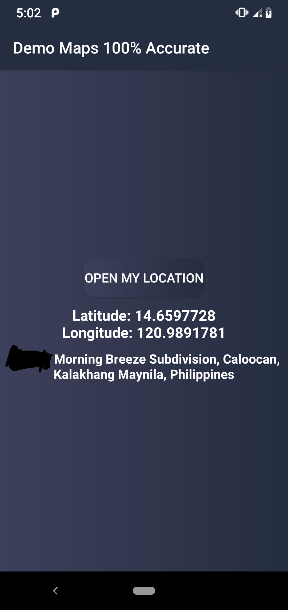

# Android-Maps-100-Accurate
The maps is base from permission of the user its required to accept the permission and you need a internet too.

<h1>Requirements: </h1>

- Internet
- Google service and Location maps must be on in Settings.

<h1> Download the Apk: </h1>

First click the link then View Raw it will be downloaded automatically.

[Download the apk here!](https://github.com/JohnBrix/Android-Maps-100-Accurate/blob/master/screenshot/demo.apk)

<h2>Actually Location: </h2>

<file src="screenshot/demo.apk" >
  
